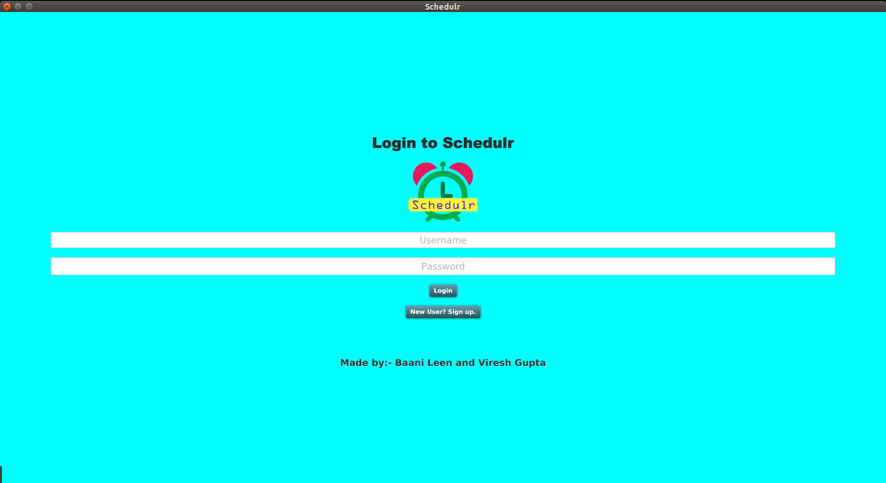
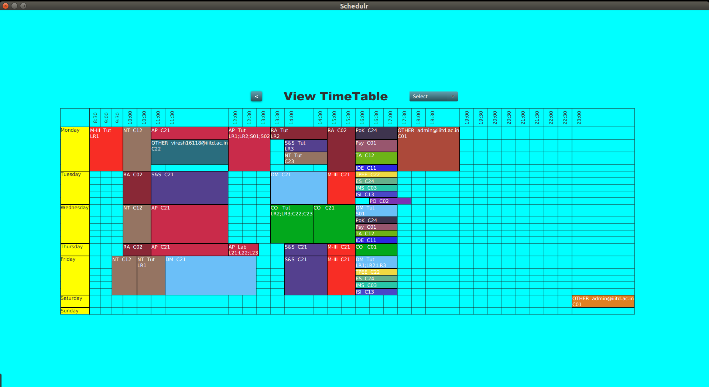
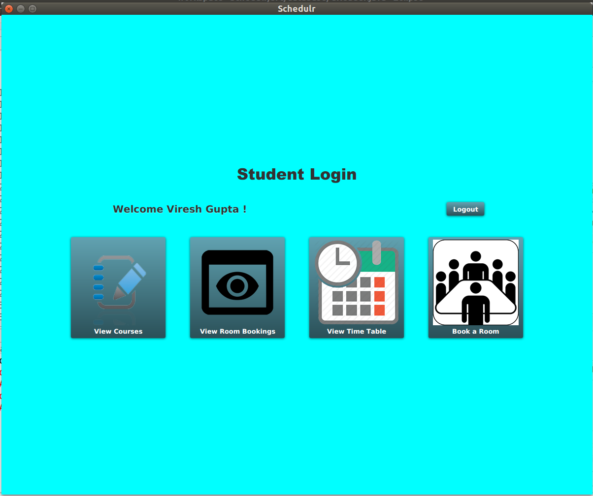

# Schedulr


Made by :
Baani Leen and Viresh Gupta

A javafx based program to handle the time table management of an institution
Supports functionality for 
<ul>
<li>Student
  <ul>
    <li> View and Register for courses
    <li> View global and personalised timetable
    <li> Place a request for TimeTable Booking
    <li> Cancel bookings already made
  </ul>
<li>Faculty
  <ul>
    <li> View and Register for courses
    <li> View global and personalised timetable
    <li> Book slots in TimeTable
    <li> Cancel bookings already made
  </ul>
<li>Admin
  <ul>
    <li> Accept/Reject Requests from students
    <li> View global and personalised timetable
    <li> Place a request for TimeTable Booking
    <li> View Bookings by any person and power to cancel them
  </ul>
</ul>

See the complete documentation for JAVA files at https://virresh.github.io/Schedulr/








# Instructions to Run:
Clone this repository (preferably in Eclipse with the e(fx) plugin installed).

Modify ``` Constants.constant ``` class to change the port and IP of server as required

Execute ``` server.ServerRunner ``` class first to setup a server. Note only one instance can be run of this class.

Execute ``` application.Main ``` class as many number of times as required. Can also be ran on different pc's on same network.
